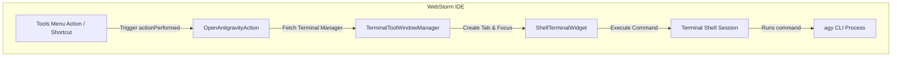

# Antigravity WebStorm Plugin Implementation Plan

> **For agentic workers:** REQUIRED SUB-SKILL: Use superpowers:subagent-driven-development to implement this plan task-by-task. Steps use checkbox (`- [ ]`) syntax for tracking.

**Goal:** Create a distributable IntelliJ Platform plugin for WebStorm that runs the `agy` command in a native terminal tab.

**Architecture:** 
The plugin defines an action (`OpenAntigravityAction`) registered in the WebStorm Tools menu. When invoked, it uses `TerminalToolWindowManager` to open a new tab in the terminal tool window, focus it, and execute the `agy` shell command. It is built using Kotlin and JVM 21, and utilizes the modern IntelliJ Platform Gradle plugin (`org.jetbrains.intellij.platform`).

**Architecture Diagram:**



**Tech Stack:** 
- **Language:** Kotlin
- **JDK:** OpenJDK 21
- **Build Tool:** Gradle with IntelliJ Platform Gradle Plugin (v2.x)
- **Target Platform:** WebStorm / IntelliJ Platform (2024.1+)

---

### Task 1: Environment Setup & Project Initialization

**Files:**
- Create Directory: `/Users/alex/Dev/yabbadabbadev/antigravity-webstorm-plugin`
- Create wrapper: `/Users/alex/Dev/yabbadabbadev/antigravity-webstorm-plugin/gradlew`

- [x] **Step 1: Install Gradle via Homebrew**
  Run: `brew install gradle`
  Expected: Gradle is installed and output contains a successful install message.

- [x] **Step 2: Create project directory and generate Gradle wrapper**
  Run:
  ```bash
  mkdir -p /Users/alex/Dev/yabbadabbadev/antigravity-webstorm-plugin
  cd /Users/alex/Dev/yabbadabbadev/antigravity-webstorm-plugin
  gradle wrapper --gradle-version 8.7
  ```
  Expected: Gradle wrapper files (`gradlew`, `gradle/wrapper/gradle-wrapper.properties`) are generated inside `/Users/alex/Dev/yabbadabbadev/antigravity-webstorm-plugin`.

---

### Task 2: Build and Project Configurations

**Files:**
- Create: `/Users/alex/Dev/yabbadabbadev/antigravity-webstorm-plugin/settings.gradle.kts`
- Create: `/Users/alex/Dev/yabbadabbadev/antigravity-webstorm-plugin/build.gradle.kts`
- Create: `/Users/alex/Dev/yabbadabbadev/antigravity-webstorm-plugin/gradle.properties`

- [x] **Step 1: Create `settings.gradle.kts`**
  Write file contents to `/Users/alex/Dev/yabbadabbadev/antigravity-webstorm-plugin/settings.gradle.kts`:
  ```kotlin
  rootProject.name = "antigravity-webstorm-plugin"
  ```

- [x] **Step 2: Create `gradle.properties`**
  Write file contents to `/Users/alex/Dev/yabbadabbadev/antigravity-webstorm-plugin/gradle.properties`:
  ```properties
  kotlin.code.style=official
  ```

- [x] **Step 3: Create `build.gradle.kts`**
  Write file contents to `/Users/alex/Dev/yabbadabbadev/antigravity-webstorm-plugin/build.gradle.kts`:
  ```kotlin
  plugins {
      id("org.jetbrains.kotlin.jvm") version "1.9.22"
      id("org.jetbrains.intellij.platform") version "2.0.1"
  }

  group = "com.antigravity.plugin"
  version = "1.0.0"

  repositories {
      mavenCentral()
      intellijPlatform {
          defaultRepositories()
      }
  }

  dependencies {
      intellijPlatform {
          webstorm("2024.1")
          bundledPlugins("org.jetbrains.plugins.terminal")
          instrumentationTools()
      }
  }

  intellijPlatform {
      pluginConfiguration {
          name = "Antigravity CLI"
      }
  }
  ```

---

### Task 3: Implement Plugin Descriptor and Code

**Files:**
- Create: `/Users/alex/Dev/yabbadabbadev/antigravity-webstorm-plugin/src/main/resources/META-INF/plugin.xml`
- Create: `/Users/alex/Dev/yabbadabbadev/antigravity-webstorm-plugin/src/main/kotlin/com/antigravity/plugin/OpenAntigravityAction.kt`

- [x] **Step 1: Create directory tree for source code**
  Run:
  ```bash
  mkdir -p /Users/alex/Dev/yabbadabbadev/antigravity-webstorm-plugin/src/main/resources/META-INF
  mkdir -p /Users/alex/Dev/yabbadabbadev/antigravity-webstorm-plugin/src/main/kotlin/com/antigravity/plugin
  ```

- [x] **Step 2: Write `plugin.xml`**
  Write file contents to `/Users/alex/Dev/yabbadabbadev/antigravity-webstorm-plugin/src/main/resources/META-INF/plugin.xml`:
  ```xml
  <idea-plugin>
      <id>com.antigravity.plugin</id>
      <name>Antigravity CLI</name>
      <vendor email="support@antigravity.com" url="https://antigravity.com">Antigravity</vendor>

      <description><![CDATA[
      Opens the Antigravity CLI (agy) in a native WebStorm terminal tab.
      ]]></description>

      <depends>com.intellij.modules.platform</depends>
      <depends>org.jetbrains.plugins.terminal</depends>

      <actions>
          <action id="com.antigravity.plugin.OpenAntigravityAction"
                  class="com.antigravity.plugin.OpenAntigravityAction"
                  text="Open Antigravity CLI"
                  description="Open Antigravity CLI in a terminal tab">
              <add-to-group group-id="ToolsMenu" anchor="last"/>
              <keyboard-shortcut keymap="$default" first-keystroke="shift alt A"/>
          </action>
      </actions>
  </idea-plugin>
  ```

- [x] **Step 3: Write Action Implementation in Kotlin**
  Write file contents to `/Users/alex/Dev/yabbadabbadev/antigravity-webstorm-plugin/src/main/kotlin/com/antigravity/plugin/OpenAntigravityAction.kt`:
  ```kotlin
  package com.antigravity.plugin

  import com.intellij.openapi.actionSystem.AnAction
  import com.intellij.openapi.actionSystem.AnActionEvent
  import com.intellij.openapi.project.Project
  import com.intellij.openapi.ui.Messages
  import org.jetbrains.plugins.terminal.TerminalToolWindowManager

  class OpenAntigravityAction : AnAction() {
      override fun actionPerformed(e: AnActionEvent) {
          val project = e.project ?: return
          
          try {
              // Try using modern 2024.1+ API
              val manager = TerminalToolWindowManager.getInstance(project)
              val widget = manager.createShellWidget(
                  project.basePath ?: System.getProperty("user.home"),
                  "Antigravity CLI",
                  true,
                  true
              )
              widget.sendCommandToExecute("agy")
          } catch (ex: Throwable) {
              // Fallback to classic Pre-2024.1 APIs reflection
              try {
                  val terminalViewClass = Class.forName("org.jetbrains.plugins.terminal.TerminalView")
                  val getInstance = terminalViewClass.getMethod("getInstance", Project::class.java)
                  val instance = getInstance.invoke(null, project)
                  val createLocalShellWidget = terminalViewClass.getMethod("createLocalShellWidget", String::class.java, String::class.java)
                  val widget = createLocalShellWidget.invoke(instance, project.basePath ?: System.getProperty("user.home"), "Antigravity CLI")
                  val executeCommand = widget.javaClass.getMethod("executeCommand", String::class.java)
                  executeCommand.invoke(widget, "agy")
              } catch (fallbackEx: Throwable) {
                  // If both fail, print to stdout or handle
                  fallbackEx.printStackTrace()
                  Messages.showErrorDialog(project, "Could not open Antigravity CLI", "Error")
              }
          }
      }
  }
  ```

---

### Task 4: Compile & Packaging

**Files:**
- Output ZIP: `/Users/alex/Dev/yabbadabbadev/antigravity-webstorm-plugin/build/distributions/antigravity-webstorm-plugin-1.0.0.zip`

- [x] **Step 1: Compile and build the plugin**
  Run:
  ```bash
  cd /Users/alex/Dev/yabbadabbadev/antigravity-webstorm-plugin
  ./gradlew buildPlugin
  ```
  Expected: Gradle build is successful.

- [x] **Step 2: Verify package existence**
  Run:
  ```bash
  ls -l /Users/alex/Dev/yabbadabbadev/antigravity-webstorm-plugin/build/distributions/
  ```
  Expected: `antigravity-webstorm-plugin-1.0.0.zip` is present in the directory and is of non-zero size.
