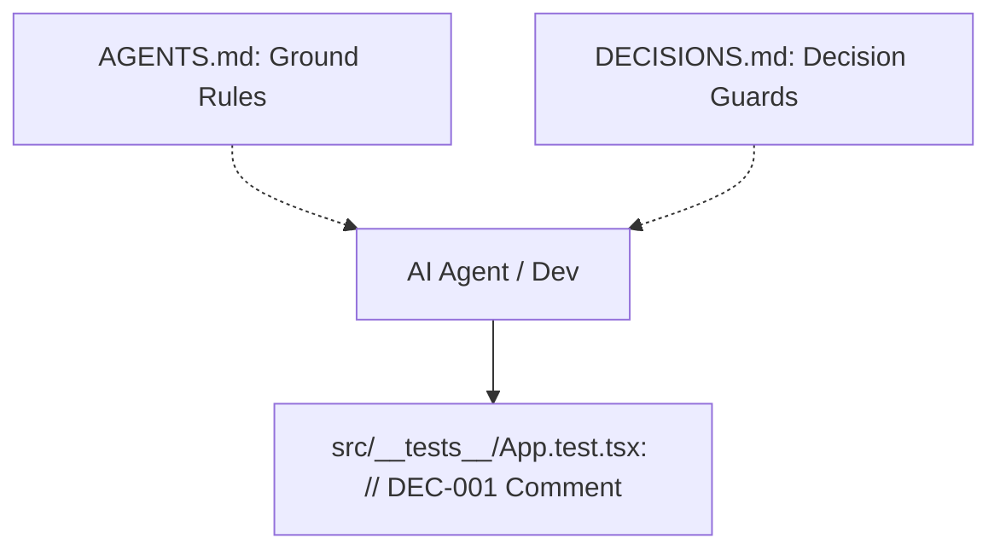

# AI Agent Optimization Implementation Plan

> **For agentic workers:** REQUIRED SUB-SKILL: Use superpowers:subagent-driven-development to implement this plan task-by-task. Steps use checkbox (`- [ ]`) syntax for tracking.

**Goal:** Configure the repository for optimal AI agent usage by setting Ground Rules (AGENTS.md), Decision Guards (DECISIONS.md), and correcting the failing boilerplate test.

**Architecture:**
The optimization consists of setting up developer rules and code guards that can be easily parsed by AI agents when loaded into context. Additionally, we fix the baseline test suite.

**Architecture Diagram:**


**Tech Stack:** React 19, TypeScript, Vitest, MSW, ESLint.

---

### Task 1: Corrección de la Línea Base de Pruebas

**Files:**
- Modify: `[App.test.tsx](file:///Users/alex/Dev/yabbadabbadev/src/__tests__/App.test.tsx)`

- [ ] **Step 1: Write the failing test**
  Wait, the test is already failing. Let's write down the modification to fix it. We will change the assertion to look for `'Hello World!!!'`.

- [ ] **Step 2: Run test to verify it fails (or checks existing state)**
  Run: `npm test -- --run`
  Expected: FAIL with "Unable to find an accessible element with the role 'heading' and name 'Hello World!!'"

- [ ] **Step 3: Write minimal implementation**
  Apply the following change to `[App.test.tsx](file:///Users/alex/Dev/yabbadabbadev/src/__tests__/App.test.tsx)`:
  ```diff
  -    expect(screen.getAllByRole('heading', { name: 'Hello World!!', level: 1 }))
  +    expect(screen.getAllByRole('heading', { name: 'Hello World!!!', level: 1 }))
  ```

- [ ] **Step 4: Run test to verify it passes**
  Run: `npm test -- --run`
  Expected: PASS

- [ ] **Step 5: Commit**
  Run:
  ```bash
  git add src/__tests__/App.test.tsx
  git commit -m "test: fix baseline test in App.test.tsx"
  ```

---

### Task 2: Configuración de Decision Guards (DECISIONS.md)

**Files:**
- Create: `[DECISIONS.md](file:///Users/alex/Dev/yabbadabbadev/DECISIONS.md)`
- Modify: `[App.test.tsx](file:///Users/alex/Dev/yabbadabbadev/src/__tests__/App.test.tsx)`

- [ ] **Step 1: Create the DECISIONS.md registry**
  Write the following content to `[DECISIONS.md](file:///Users/alex/Dev/yabbadabbadev/DECISIONS.md)`:
  ```markdown
  # Registro de Decisiones de Arquitectura (Decision Guards)

  Este documento registra decisiones de diseño deliberadas en este repositorio que pueden parecer subóptimas o erróneas a primera vista, pero que tienen una justificación técnica o de negocio importante.

  **Regla para Agentes de IA:**
  - Si encuentras un comentario con el prefijo `// DEC-XXX` en el código, DEBES buscar su identificador en este archivo y respetar la lógica descrita antes de sugerir o realizar cualquier modificación.

  ---

  ## DEC-001
  - **Ubicación**: `src/__tests__/App.test.tsx`
  - **Tema**: Validación exacta del encabezado de la App.
  - **Justificación**: El encabezado de Hello World con tres signos de exclamación `!!!` es el branding definido por el boilerplate; los tests deben reflejar exactamente este string.
  ```

- [ ] **Step 2: Add inline decision guard comment to the code**
  Modify `[App.test.tsx](file:///Users/alex/Dev/yabbadabbadev/src/__tests__/App.test.tsx)` to include the `// DEC-001` comment:
  ```diff
       render(<App />)
   
  -    expect(screen.getAllByRole('heading', { name: 'Hello World!!!', level: 1 }))
  +    // DEC-001: El branding con tres signos de exclamación es intencional
  +    expect(screen.getAllByRole('heading', { name: 'Hello World!!!', level: 1 }))
     })
  ```

- [ ] **Step 3: Run verification tests**
  Run: `npm test -- --run`
  Expected: PASS

- [ ] **Step 4: Commit**
  Run:
  ```bash
  git add DECISIONS.md src/__tests__/App.test.tsx
  git commit -m "feat: add DECISIONS.md and register DEC-001 guard"
  ```

---

### Task 3: Configuración de Ground Rules (AGENTS.md)

**Files:**
- Create: `[AGENTS.md](file:///Users/alex/Dev/yabbadabbadev/AGENTS.md)`

- [ ] **Step 1: Write the AGENTS.md rules document**
  Write the following content to `[AGENTS.md](file:///Users/alex/Dev/yabbadabbadev/AGENTS.md)`:
  ```markdown
  # AI Agent Guidelines & Ground Rules

  Este archivo proporciona directrices críticas para cualquier agente de IA que trabaje en este repositorio. Estas instrucciones anulan comportamientos predeterminados y deben seguirse estrictamente.

  ---

  ## 1. Comandos de Verificación
  Antes de dar cualquier tarea por completada o afirmar que todo funciona, debes ejecutar:
  - **Pruebas unitarias**: `npm test -- --run`
  - **Linting & Type-checking**: `npm run lint` y `npm run build`

  ---

  ## 2. Decision Guards (DECISIONS.md)
  - Si encuentras un comentario con el prefijo `// DEC-XXX` en cualquier archivo, **DEBES** leer su entrada correspondiente en `DECISIONS.md` antes de sugerir, editar o refactorizar el código asociado.
  - Al introducir intencionalmente una solución no convencional o un trade-off de diseño crítico (ej. rendimiento, hacks de compatibilidad), crea una entrada en `DECISIONS.md` y añade el comentario inline correspondiente en el código.

  ---

  ## 3. Normas de Calidad de Código y Estructura

  ### 3.1. TypeScript Estricto
  - Todo componente, función o hook debe tener declaraciones de tipos explícitas para sus parámetros y tipo de retorno.
  - Evita el uso de `any`. Si es absolutamente necesario, justifica su uso o decláralo como `unknown` y realiza estrechamiento de tipos (type narrowing).

  ### 3.2. Desarrollo Orientado a Pruebas (TDD)
  - Sigue la metodología **Red-Green-Refactor**:
    1. Crea o modifica un test unitario/integración en `src/__tests__/` que falle para representar el cambio deseado.
    2. Escribe el código mínimo necesario en `src/` para hacer pasar el test.
    3. Refactoriza el código asegurándote de que la suite siga en verde.

  ### 3.3. Mocking con MSW (Mock Service Worker)
  - No realices peticiones de red reales en los entornos de prueba.
  - Todo mock de APIs de red debe residir en `src/mocks/handlers.ts`. Registra nuevos controladores allí.

  ### 3.4. Arquitectura de Componentes
  - **Single Responsibility Principle**: Mantén los componentes pequeños y enfocados en una sola función visual o lógica.
  - **Custom Hooks**: Extrae los efectos (`useEffect`), estados complejos o integraciones de APIs en custom hooks separados (ej. `src/hooks/useData.ts`).
  - **Límite de tamaño**: Los archivos de componentes React no deben exceder las 150 líneas de código. Si crecen más, sepáralos en subcomponentes o custom hooks.

  ---

  ## 4. Gestión de Contexto de IA
  - Para tareas complejas, utiliza `/docs/superpowers/specs/` para diseñar y validar especificaciones de diseño con el usuario humano antes de escribir código de implementación.
  - Utiliza `/docs/superpowers/plans/` para escribir y seguir planes de implementación paso a paso.
  - Extrae conocimiento útil o correcciones que surjan durante la sesión en documentos de conocimiento (`docs/`) si consideras que pueden ser útiles en futuras sesiones.
  ```

- [ ] **Step 2: Run verification tools**
  Run: `npm run lint`
  Expected: Success without errors.

- [ ] **Step 3: Commit**
  Run:
  ```bash
  git add AGENTS.md
  git commit -m "feat: add AGENTS.md with AI agent ground rules"
  ```
