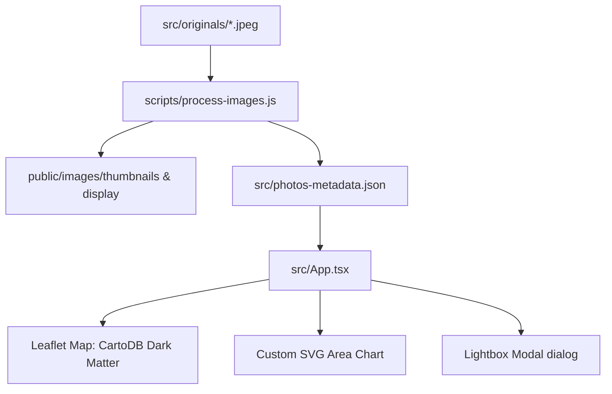

# Photo Map and Timeline Dashboard Implementation Plan

> **For agentic workers:** REQUIRED SUB-SKILL: Use superpowers:subagent-driven-development to implement this plan task-by-task. Steps use checkbox (`- [ ]`) syntax for tracking.

**Goal:** Create a high-performance, dark-theme dashboard featuring an interactive Leaflet map displaying photo thumbnails at their capture locations (parsed at build-time) and a custom SVG timeline showing the capturing date distribution.

**Architecture:**
A Node.js pre-processing script runs before build/dev to parse EXIF metadata (GPS and capture date) of images in `src/originals/` using `exifreader`, generate resized thumbnails and display-optimized versions using `sharp`, and write a static JSON metadata registry (`src/photos-metadata.json`). The React frontend loads the JSON to render Leaflet map markers and a bespoke SVG area chart, with a modal lightbox for detailed view.

**Architecture Diagram:**


**Tech Stack:** React 19, TypeScript, Leaflet, Sharp, ExifReader, Vitest.

---

### Task 1: Script de Preprocesamiento de Imágenes

**Files:**
- Create: `[process-images.js](file:///Users/alex/Dev/yabbadabbadev/scripts/process-images.js)`
- Modify: `[package.json](file:///Users/alex/Dev/yabbadabbadev/package.json)`

- [ ] **Step 1: Create the process-images.js script**
  Create the folder `scripts/` if not exists, and write `scripts/process-images.js` to read files from `src/originals/`, extract EXIF coordinates and capture dates, crop/resize thumbnails to 120x120px in `public/images/thumbnails/`, resize display-optimized images to max 1200px in `public/images/display/`, and write the JSON database to `src/photos-metadata.json`:
  ```javascript
  const fs = require('fs');
  const path = require('path');
  const ExifReader = require('exifreader');
  const sharp = require('sharp');

  const ORIGINALS_DIR = path.join(__dirname, '../src/originals');
  const OUTPUT_DIR = path.join(__dirname, '../public/images');
  const METADATA_FILE = path.join(__dirname, '../src/photos-metadata.json');

  async function main() {
    console.log('Starting image processing...');
    if (!fs.existsSync(ORIGINALS_DIR)) {
      console.error(`Originals directory not found: ${ORIGINALS_DIR}`);
      process.exit(1);
    }
    
    // Ensure output directories exist
    fs.mkdirSync(path.join(OUTPUT_DIR, 'thumbnails'), { recursive: true });
    fs.mkdirSync(path.join(OUTPUT_DIR, 'display'), { recursive: true });

    const files = fs.readdirSync(ORIGINALS_DIR).filter(f => /\.(jpe?g|png)$/i.test(f));
    const metadata = [];

    for (const file of files) {
      const inputPath = path.join(ORIGINALS_DIR, file);
      const name = path.parse(file).name;
      
      const fileBuffer = fs.readFileSync(inputPath);
      const tags = ExifReader.load(fileBuffer);
      
      const lat = tags.GPSLatitude ? tags.GPSLatitude.description : null;
      const lon = tags.GPSLongitude ? tags.GPSLongitude.description : null;
      const dateTag = tags.DateTimeOriginal ? tags.DateTimeOriginal.description : (tags.DateTime ? tags.DateTime.description : null);
      
      if (lat === null || lon === null) {
        console.warn(`Skipping ${file}: Missing GPS metadata`);
        continue;
      }
      
      // Parse Date (EXIF date format: "YYYY:MM:DD HH:MM:SS" -> "YYYY-MM-DD")
      let dateStr = '2025-01-01';
      if (dateTag) {
        const parts = dateTag.split(' ');
        if (parts[0]) {
          dateStr = parts[0].replace(/:/g, '-');
        }
      }
      
      const parsedDate = new Date(dateStr);
      const year = parsedDate.getFullYear() || 2025;
      const month = parsedDate.getMonth() + 1 || 1;

      const thumbFilename = `${name}.jpeg`;
      const displayFilename = `${name}.jpeg`;

      // Generate thumbnail: 120x120px square cropped
      await sharp(fileBuffer)
        .resize(120, 120, { fit: 'cover' })
        .toFormat('jpeg', { quality: 80 })
        .toFile(path.join(OUTPUT_DIR, 'thumbnails', thumbFilename));

      // Generate display version: max 1200px inside
      await sharp(fileBuffer)
        .resize(1200, 1200, { fit: 'inside', withoutEnlargement: true })
        .toFormat('jpeg', { quality: 85 })
        .toFile(path.join(OUTPUT_DIR, 'display', displayFilename));

      metadata.push({
        id: name,
        filename: file,
        lat: parseFloat(lat),
        lon: parseFloat(lon),
        date: dateStr,
        year,
        month,
        thumbnail: `/images/thumbnails/${thumbFilename}`,
        display: `/images/display/${displayFilename}`
      });
      console.log(`Processed ${file}: Lat=${lat}, Lon=${lon}, Date=${dateStr}`);
    }

    fs.writeFileSync(METADATA_FILE, JSON.stringify(metadata, null, 2));
    console.log(`Wrote metadata database of ${metadata.length} photos.`);
  }

  main().catch(err => {
    console.error('Error processing images:', err);
    process.exit(1);
  });
  ```

- [ ] **Step 2: Update package.json scripts**
  Integrate the image processing script in `package.json` to execute before Vite runs in dev or build:
  ```diff
     "scripts": {
  -    "dev": "vite",
  +    "dev": "node scripts/process-images.js && vite",
       "test": "vitest",
  -    "build": "tsc -b && vite build",
  +    "build": "node scripts/process-images.js && tsc -b && vite build",
       "lint": "eslint .",
  ```

- [ ] **Step 3: Run the script to verify generation**
  Run: `node scripts/process-images.js`
  Expected: Success output showing processed files, metadata file `src/photos-metadata.json` created, and processed images present in `public/images/`.

- [ ] **Step 4: Commit**
  Run:
  ```bash
  git add scripts/process-images.js package.json
  git commit -m "feat: add build-time image processing script and automate package scripts"
  ```

---

### Task 2: Configuración de Estilos Globales (index.css)

**Files:**
- Modify: `[index.css](file:///Users/alex/Dev/yabbadabbadev/src/index.css)`

- [ ] **Step 1: Add Leaflet and modern UI dashboard styles**
  Apply the following styles to `[index.css](file:///Users/alex/Dev/yabbadabbadev/src/index.css)`:
  ```css
  /* Import Leaflet CSS */
  @import 'leaflet/dist/leaflet.css';

  :root {
    font-family: 'Outfit', 'Inter', system-ui, -apple-system, sans-serif;
    line-height: 1.5;
    font-weight: 400;

    color-scheme: dark;
    background-color: #0b0f19;
    color: #e2e8f0;
  }

  body {
    margin: 0;
    padding: 0;
    overflow: hidden;
    height: 100vh;
    width: 100vw;
  }

  /* Custom Leaflet Dark Marker Styles */
  .custom-photo-pin {
    background: none;
    border: none;
  }

  .pin-wrapper {
    position: relative;
    width: 44px;
    height: 44px;
    cursor: pointer;
    transition: transform 0.2s cubic-bezier(0.175, 0.885, 0.32, 1.275);
  }

  .pin-wrapper:hover {
    transform: scale(1.2) translateY(-4px);
    z-index: 1000 !important;
  }

  .pin-wrapper.active {
    transform: scale(1.3) translateY(-6px);
    z-index: 1001 !important;
  }

  .pin-image-container {
    width: 40px;
    height: 40px;
    border-radius: 50%;
    border: 2px solid #a855f7; /* Purple Glow */
    box-shadow: 0 0 10px rgba(168, 85, 247, 0.6);
    overflow: hidden;
    background: #0f172a;
    transition: border-color 0.2s, box-shadow 0.2s;
  }

  .pin-wrapper.active .pin-image-container {
    border-color: #06b6d4; /* Cyan Active */
    box-shadow: 0 0 15px rgba(6, 182, 212, 0.8);
  }

  .pin-image {
    width: 100%;
    height: 100%;
    object-fit: cover;
  }

  .pin-pointer {
    position: absolute;
    bottom: -6px;
    left: 50%;
    transform: translateX(-50%);
    width: 0;
    height: 0;
    border-left: 6px solid transparent;
    border-right: 6px solid transparent;
    border-top: 8px solid #a855f7;
    transition: border-top-color 0.2s;
  }

  .pin-wrapper.active .pin-pointer {
    border-top-color: #06b6d4;
  }

  /* Glassmorphism Classes */
  .glass-panel {
    background: rgba(15, 23, 42, 0.65);
    backdrop-filter: blur(12px);
    -webkit-backdrop-filter: blur(12px);
    border: 1px solid rgba(255, 255, 255, 0.08);
    box-shadow: 0 8px 32px 0 rgba(0, 0, 0, 0.37);
  }

  /* Leaflet Dark Overlay Adjustments */
  .leaflet-container {
    background: #090d16 !important;
    font-family: inherit;
  }

  /* Hide Leaflet default zoom borders */
  .leaflet-bar {
    border: 1px solid rgba(255, 255, 255, 0.1) !important;
    box-shadow: none !important;
    border-radius: 8px !important;
    overflow: hidden;
  }

  .leaflet-bar a {
    background-color: rgba(15, 23, 42, 0.8) !important;
    color: #e2e8f0 !important;
    border-bottom: 1px solid rgba(255, 255, 255, 0.1) !important;
    backdrop-filter: blur(8px);
  }

  .leaflet-bar a:hover {
    background-color: rgba(30, 41, 59, 0.9) !important;
  }
  ```

- [ ] **Step 2: Commit**
  Run:
  ```bash
  git add src/index.css
  git commit -m "style: add leaflet and dashboard custom styles with glassmorphism"
  ```

---

### Task 3: Implementación del Dashboard Frontend (App.tsx)

**Files:**
- Modify: `[App.tsx](file:///Users/alex/Dev/yabbadabbadev/src/App.tsx)`
- Create: `[App.test.tsx](file:///Users/alex/Dev/yabbadabbadev/src/__tests__/App.test.tsx)`

- [ ] **Step 1: Write the App.tsx component**
  Write the React dashboard with the Leaflet map container, custom HTML marker generation, interactive custom SVG area timeline chart, photo filters by timeline node, and HTML dialog lightbox.
  ```typescript
  import { useEffect, useRef, useState, useMemo } from 'react'
  import L from 'leaflet'
  import rawMetadata from './photos-metadata.json'

  interface PhotoMetadata {
    id: string
    filename: string
    lat: number
    lon: number
    date: string
    year: number
    month: number
    thumbnail: string
    display: string
  }

  const photos: PhotoMetadata[] = rawMetadata as PhotoMetadata[]

  const App = () => {
    const mapRef = useRef<HTMLDivElement>(null)
    const mapInstance = useRef<L.Map | null>(null)
    const markersRef = useRef<{ [key: string]: L.Marker }>({})
    const [selectedPhoto, setSelectedPhoto] = useState<PhotoMetadata | null>(null)
    const [hoveredTimeNode, setHoveredTimeNode] = useState<string | null>(null)
    const [selectedTimeNode, setSelectedTimeNode] = useState<string | null>(null)
    const dialogRef = useRef<HTMLDialogElement>(null)

    // Format Dates helper
    const formatDate = (dateStr: string) => {
      const d = new Date(dateStr)
      return d.toLocaleDateString('es-ES', { year: 'numeric', month: 'long', day: 'numeric' })
    }

    // Group photos by Year-Month for the timeline chart
    const timelineData = useMemo(() => {
      const counts: { [key: string]: { count: number; label: string; year: number; month: number; photos: PhotoMetadata[] } } = {}
      
      photos.forEach(photo => {
        const key = `${photo.year}-${photo.month.toString().padStart(2, '0')}`
        if (!counts[key]) {
          const monthLabel = new Date(photo.year, photo.month - 1).toLocaleDateString('es-ES', { month: 'short' })
          counts[key] = {
            count: 0,
            label: `${monthLabel} ${photo.year}`,
            year: photo.year,
            month: photo.month,
            photos: []
          }
        }
        counts[key].count++
        counts[key].photos.push(photo)
      })

      return Object.entries(counts)
        .sort((a, b) => a[0].localeCompare(b[0]))
        .map(([key, data]) => ({ key, ...data }))
    }, [])

    // Highlight markers on map when time node is hovered or selected
    const highlightedPhotoIds = useMemo(() => {
      const activeNode = hoveredTimeNode || selectedTimeNode
      if (!activeNode) return new Set<string>()
      const data = timelineData.find(d => d.key === activeNode)
      return new Set(data ? data.photos.map(p => p.id) : [])
    }, [hoveredTimeNode, selectedTimeNode, timelineData])

    // Leaflet map setup
    useEffect(() => {
      if (!mapRef.current || mapInstance.current) return

      // Create map
      const map = L.map(mapRef.current, {
        zoomControl: false
      }).setView([25, 10], 2)
      mapInstance.current = map

      // Add zoom control to topright
      L.control.zoom({ position: 'topright' }).addTo(map)

      // Add CartoDB Dark Matter tiles
      L.tileLayer('https://{s}.basemaps.cartocdn.com/dark_all/{z}/{x}/{y}{r}.png', {
        attribution: '&copy; <a href="https://www.openstreetmap.org/copyright">OpenStreetMap</a> contributors &copy; <a href="https://carto.com/attributions">CARTO</a>',
        maxZoom: 20
      }).addTo(map)

      // Add Markers
      const markerGroup = L.featureGroup()
      
      photos.forEach(photo => {
        const pinHtml = `
          <div class="pin-wrapper" id="pin-${photo.id}">
            <div class="pin-image-container">
              
            </div>
            <div class="pin-pointer"></div>
          </div>
        `

        const markerIcon = L.divIcon({
          html: pinHtml,
          className: 'custom-photo-pin',
          iconSize: [44, 44],
          iconAnchor: [22, 44]
        })

        const marker = L.marker([photo.lat, photo.lon], { icon: markerIcon })
          .on('click', () => {
            setSelectedPhoto(photo)
          })
          .addTo(map)

        markersRef.current[photo.id] = marker
        markerGroup.addLayer(marker)
      })

      // Fit map bounds to markers if we have any
      if (photos.length > 0) {
        map.fitBounds(markerGroup.getBounds(), { padding: [50, 50] })
      }

      return () => {
        map.remove()
        mapInstance.current = null
      }
    }, [])

    // Update active visual status for markers when highlightedPhotoIds changes
    useEffect(() => {
      photos.forEach(photo => {
        const pinEl = document.getElementById(`pin-${photo.id}`)
        if (pinEl) {
          if (highlightedPhotoIds.has(photo.id)) {
            pinEl.classList.add('active')
          } else {
            pinEl.classList.remove('active')
          }
        }
      })
    }, [highlightedPhotoIds])

    // Focus map on photo if selected
    useEffect(() => {
      if (selectedPhoto && mapInstance.current) {
        mapInstance.current.setView([selectedPhoto.lat, selectedPhoto.lon], 10, {
          animate: true
        })
        dialogRef.current?.showModal()
      }
    }, [selectedPhoto])

    // Handle closing the dialog
    const handleCloseDialog = () => {
      dialogRef.current?.close()
      setSelectedPhoto(null)
    }

    // SVG Timeline config
    const chartHeight = 60
    const chartWidth = 500
    const padding = 20

    const points = useMemo(() => {
      if (timelineData.length === 0) return []
      const maxCount = Math.max(...timelineData.map(d => d.count))
      const xScale = (chartWidth - padding * 2) / Math.max(1, timelineData.length - 1)
      const yScale = (chartHeight - padding * 2) / Math.max(1, maxCount)

      return timelineData.map((d, index) => ({
        x: padding + index * xScale,
        y: chartHeight - padding - d.count * yScale,
        ...d
      }))
    }, [timelineData])

    const linePath = useMemo(() => {
      if (points.length === 0) return ''
      return points.reduce((path, p, i) => {
        return i === 0 ? `M ${p.x} ${p.y}` : `${path} L ${p.x} ${p.y}`
      }, '')
    }, [points])

    const areaPath = useMemo(() => {
      if (points.length === 0) return ''
      const first = points[0]
      const last = points[points.length - 1]
      return `${linePath} L ${last.x} ${chartHeight - padding} L ${first.x} ${chartHeight - padding} Z`
    }, [points, linePath])

    return (
      <div style={{ width: '100vw', height: '100vh', position: 'relative' }}>
        {/* Fullscreen Map */}
        <div ref={mapRef} style={{ width: '100%', height: '100%' }} />

        {/* Floating Header */}
        <header
          className="glass-panel"
          style={{
            position: 'absolute',
            top: '20px',
            left: '20px',
            zIndex: 1000,
            padding: '16px 24px',
            borderRadius: '16px',
            display: 'flex',
            flexDirection: 'column',
            gap: '4px',
            pointerEvents: 'auto'
          }}
        >
          <h1 style={{ margin: 0, fontSize: '20px', fontWeight: 600, background: 'linear-gradient(135deg, #c084fc, #67e8f9)', WebkitBackgroundClip: 'text', WebkitTextFillColor: 'transparent' }}>
            Explorador de Viajes
          </h1>
          <span style={{ fontSize: '12px', color: '#94a3b8' }}>
            {photos.length} fotos capturadas con metadatos GPS
          </span>
        </header>

        {/* Floating Bottom Timeline Panel */}
        <div
          className="glass-panel"
          style={{
            position: 'absolute',
            bottom: '30px',
            left: '50%',
            transform: 'translateX(-50%)',
            zIndex: 1000,
            padding: '16px 24px',
            borderRadius: '20px',
            width: 'calc(100% - 40px)',
            maxWidth: '560px',
            display: 'flex',
            flexDirection: 'column',
            gap: '12px',
            pointerEvents: 'auto'
          }}
        >
          <div style={{ display: 'flex', justifyContent: 'space-between', alignItems: 'center' }}>
            <h3 style={{ margin: 0, fontSize: '14px', fontWeight: 600, color: '#e2e8f0' }}>Línea Temporal de Capturas</h3>
            {selectedTimeNode && (
              <button
                onClick={() => setSelectedTimeNode(null)}
                style={{ background: 'none', border: 'none', color: '#06b6d4', fontSize: '11px', cursor: 'pointer', fontWeight: 500, padding: 0 }}
              >
                Limpiar filtro
              </button>
            )}
          </div>

          {/* SVG Custom Spline Chart */}
          <div style={{ width: '100%', height: `${chartHeight}px`, overflow: 'visible' }}>
            <svg viewBox={`0 0 ${chartWidth} ${chartHeight}`} width="100%" height="100%" style={{ overflow: 'visible' }}>
              <defs>
                <linearGradient id="timeline-grad" x1="0" y1="0" x2="0" y2="1">
                  <stop offset="0%" stopColor="#a855f7" stopOpacity="0.4" />
                  <stop offset="100%" stopColor="#a855f7" stopOpacity="0.0" />
                </linearGradient>
              </defs>

              {/* Grid Line */}
              <line x1={padding} y1={chartHeight - padding} x2={chartWidth - padding} y2={chartHeight - padding} stroke="rgba(255,255,255,0.1)" strokeWidth="1" />

              {/* Area */}
              {areaPath && <path d={areaPath} fill="url(#timeline-grad)" />}

              {/* Line */}
              {linePath && <path d={linePath} fill="none" stroke="#a855f7" strokeWidth="2.5" />}

              {/* Time Nodes */}
              {points.map((p) => {
                const isHovered = hoveredTimeNode === p.key
                const isSelected = selectedTimeNode === p.key
                const radius = isSelected ? 6 : isHovered ? 5 : 4
                const color = isSelected ? '#06b6d4' : isHovered ? '#c084fc' : '#a855f7'
                
                return (
                  <g key={p.key}>
                    <circle
                      cx={p.x}
                      cy={p.y}
                      r={radius}
                      fill={color}
                      stroke="#0f172a"
                      strokeWidth="1.5"
                      style={{ cursor: 'pointer', transition: 'r 0.2s, fill 0.2s' }}
                      onMouseEnter={() => setHoveredTimeNode(p.key)}
                      onMouseLeave={() => setHoveredTimeNode(null)}
                      onClick={() => setSelectedTimeNode(isSelected ? null : p.key)}
                    />
                    {/* Tick Label */}
                    <text
                      x={p.x}
                      y={chartHeight - 4}
                      fill={isSelected ? '#06b6d4' : isHovered ? '#e2e8f0' : '#64748b'}
                      fontSize="9"
                      textAnchor="middle"
                      style={{ pointerEvents: 'none', transition: 'fill 0.2s' }}
                    >
                      {p.label}
                    </text>
                  </g>
                )
              })}
            </svg>
          </div>
        </div>

        {/* Lightbox Dialog Modal */}
        <dialog
          ref={dialogRef}
          onClose={handleCloseDialog}
          className="glass-panel"
          style={{
            border: '1px solid rgba(255, 255, 255, 0.1)',
            borderRadius: '24px',
            padding: 0,
            maxWidth: '90vw',
            width: '640px',
            outline: 'none',
            color: '#f8fafc',
            overflow: 'hidden'
          }}
        >
          {selectedPhoto && (
            <div style={{ display: 'flex', flexDirection: 'column' }}>
              {/* Large Display Image */}
              <div style={{ width: '100%', maxHeight: '420px', overflow: 'hidden', position: 'relative', background: '#090d16' }}>
                
                <button
                  onClick={handleCloseDialog}
                  style={{
                    position: 'absolute',
                    top: '16px',
                    right: '16px',
                    width: '32px',
                    height: '32px',
                    borderRadius: '50%',
                    background: 'rgba(15, 23, 42, 0.7)',
                    border: '1px solid rgba(255, 255, 255, 0.15)',
                    color: '#f8fafc',
                    cursor: 'pointer',
                    display: 'flex',
                    alignItems: 'center',
                    justifyContent: 'center',
                    fontSize: '18px',
                    fontWeight: '300',
                    lineHeight: 1
                  }}
                >
                  &times;
                </button>
              </div>

              {/* Meta Details Panel */}
              <div style={{ padding: '24px', display: 'flex', flexDirection: 'column', gap: '16px' }}>
                <div>
                  <h2 style={{ margin: '0 0 4px 0', fontSize: '18px', fontWeight: 600 }}>{selectedPhoto.filename}</h2>
                  <span style={{ fontSize: '13px', color: '#94a3b8' }}>Capturada el {formatDate(selectedPhoto.date)}</span>
                </div>

                <div style={{ display: 'flex', flexWrap: 'wrap', gap: '24px', borderTop: '1px solid rgba(255, 255, 255, 0.08)', paddingTop: '16px' }}>
                  <div style={{ display: 'flex', flexDirection: 'column', gap: '2px' }}>
                    <span style={{ fontSize: '11px', color: '#64748b', textTransform: 'uppercase' }}>Latitud</span>
                    <span style={{ fontSize: '13px', fontWeight: 500, fontFamily: 'monospace' }}>{selectedPhoto.lat.toFixed(6)}</span>
                  </div>
                  <div style={{ display: 'flex', flexDirection: 'column', gap: '2px' }}>
                    <span style={{ fontSize: '11px', color: '#64748b', textTransform: 'uppercase' }}>Longitud</span>
                    <span style={{ fontSize: '13px', fontWeight: 500, fontFamily: 'monospace' }}>{selectedPhoto.lon.toFixed(6)}</span>
                  </div>
                  <div style={{ display: 'flex', alignItems: 'flex-end', marginLeft: 'auto' }}>
                    <a
                      href={`https://www.google.com/maps/search/?api=1&query=${selectedPhoto.lat},${selectedPhoto.lon}`}
                      target="_blank"
                      rel="noopener noreferrer"
                      style={{
                        padding: '10px 18px',
                        background: 'linear-gradient(135deg, #a855f7, #7c3aed)',
                        border: 'none',
                        borderRadius: '12px',
                        color: '#ffffff',
                        fontSize: '12px',
                        fontWeight: 600,
                        textDecoration: 'none',
                        boxShadow: '0 4px 12px rgba(168, 85, 247, 0.3)',
                        transition: 'transform 0.2s',
                        display: 'inline-block'
                      }}
                      onMouseEnter={(e) => e.currentTarget.style.transform = 'translateY(-2px)'}
                      onMouseLeave={(e) => e.currentTarget.style.transform = 'translateY(0)'}
                    >
                      Ver en Google Maps
                    </a>
                  </div>
                </div>
              </div>
            </div>
          )}
        </dialog>

        {/* Dialog Backdrop blur css overlay */}
        <style dangerouslySetInnerHTML={{__html: `
          dialog::backdrop {
            background: rgba(8, 10, 18, 0.6);
            backdrop-filter: blur(8px);
            -webkit-backdrop-filter: blur(8px);
          }
        `}} />
      </div>
    )
  }

  export { App }
  ```

- [ ] **Step 2: Rewrite App.test.tsx using Leaflet mocks**
  Mock Leaflet inside `src/__tests__/App.test.tsx` and verify that the header elements and dashboard mount successfully.

- [ ] **Step 3: Run the test suite**
  Run: `npm test -- --run`
  Expected: PASS

- [ ] **Step 4: Commit**
  Run:
  ```bash
  git add src/App.tsx src/__tests__/App.test.tsx
  git commit -m "feat: implement interactive dashboard with Leaflet map, custom SVG timeline, and detail modal"
  ```

---

### Task 4: Compilación y Verificación Final

**Files:**
- Modify: None.

- [ ] **Step 1: Run linter and full build**
  Run: `npm run lint && npm run build`
  Expected: SUCCESS

- [ ] **Step 2: Commit final build artifacts (if any changes were tracked)**
  Run:
  ```bash
  git commit -am "chore: finalize photo map and timeline integration"
  ```
