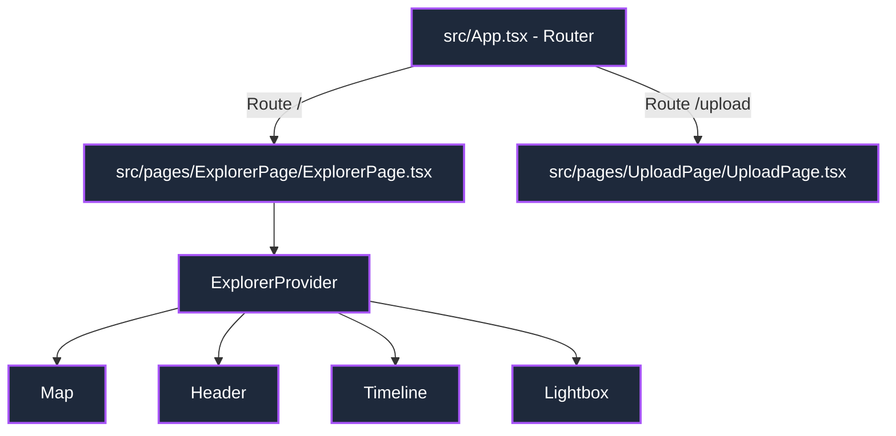

# Plan de Implementación: Refactor y Configuración de Enrutamiento

> **For agentic workers:** REQUIRED SUB-SKILL: Use superpowers:subagent-driven-development to implement this plan task-by-task. Steps use checkbox (`- [ ]`) syntax for tracking.

**Goal:** Refactorizar el Explorador de Viajes monolítico en componentes modulares que compartan el estado vía contexto siguiendo las directrices de Vercel y configurar enrutamiento con React Router Dom.

**Architecture:**
El estado de la aplicación se encapsulará en un `ExplorerProvider` que expone `{ state, actions, meta }`. Los componentes visuales consumen este contexto directamente en lugar de recibir props. La raíz de la aplicación (`src/App.tsx`) actuará como el Router, sirviendo `ExplorerPage` en la ruta `/` y `UploadPage` en `/upload`.

**Architecture Diagram:**


**Tech Stack:** React 19, TypeScript, React Router Dom v6, Leaflet, Vitest.

---

### Task 1: Instalar dependencias y crear archivo de tipos globales

**Files:**
- Modify: `package.json`
- Create: `src/types.ts`

- [ ] **Step 1: Instalar `react-router-dom`**
  Run: `npm install react-router-dom`
  Expected: Installation finishes successfully and is added to `package.json`.

- [ ] **Step 2: Crear el archivo de tipos globales `src/types.ts`**
  Escribe el archivo `src/types.ts` para compartir las interfaces básicas de fotos y línea temporal:
  ```typescript
  import L from 'leaflet'

  export interface PhotoMetadata {
    id: string
    filename: string
    lat: number
    lon: number
    date: string
    year: number
    month: number
    thumbnail: string
    display: string
  }

  export interface TimelineDataNode {
    key: string
    count: number
    label: string
    year: number
    month: number
    photos: PhotoMetadata[]
  }

  export interface TimelinePoint extends TimelineDataNode {
    x: number
    y: number
  }

  export type CountEntry = [
    string,
    { count: number; label: string; year: number; month: number; photos: PhotoMetadata[] }
  ]
  ```

- [ ] **Step 3: Ejecutar build para comprobar tipos**
  Run: `npm run build`
  Expected: PASS

---

### Task 2: Actualizar `AGENTS.md` con reglas mandatorias

**Files:**
- Modify: `AGENTS.md`

- [ ] **Step 1: Editar `AGENTS.md` para incluir directrices de estructura de componentes**
  Añade una sección obligatoria `3.5. Buenas Prácticas de Estructura y Estilado (Mandatory)` al final del bloque de normas:
  ```markdown
  ### 3.5. Estructura de Componentes y Estilos (MANDATORY)
  - **Ubicación de Componentes**: Cada componente debe residir en su propia carpeta en `src/pages/[PageName]/components/[ComponentName]/` (para componentes específicos de página) o en `src/app/components/[ComponentName]/` (para componentes comunes).
  - **Archivos Requeridos por Componente**: Cada carpeta de componente DEBE incluir:
    1. El archivo del componente principal: `[ComponentName].tsx`
    2. Su archivo de estilos asociado: `[ComponentName].css`
    3. Un archivo de tipos si es necesario: `types.ts`
    4. Un barrel de exportación: `index.ts` que haga `export * from './[ComponentName]'`
  - **Estilos en Archivos CSS**: Queda prohibido el uso de estilos inline complejos en etiquetas HTML. Los estilos específicos del componente deben residir en su respectivo archivo `.css` y ser importados localmente.
  - **Gestión de Estado**: Para flujos interactivos complejos, se debe inyectar el estado desacoplado de la UI mediante un proveedor de contexto y una interfaz genérica dividida en `{ state, actions, meta }`.
  ```

---

### Task 3: Crear el `ExplorerProvider` y Contexto

**Files:**
- Create: `src/pages/ExplorerPage/components/ExplorerProvider/types.ts`
- Create: `src/pages/ExplorerPage/components/ExplorerProvider/ExplorerProvider.tsx`
- Create: `src/pages/ExplorerPage/components/ExplorerProvider/index.ts`

- [ ] **Step 1: Crear tipos de contexto `src/pages/ExplorerPage/components/ExplorerProvider/types.ts`**
  ```typescript
  import { PhotoMetadata, TimelineDataNode } from '../../../../types'
  import L from 'leaflet'

  export interface ExplorerState {
    selectedPhoto: PhotoMetadata | null
    hoveredTimeNode: string | null
    selectedTimeNode: string | null
    highlightedPhotoIds: Set<string>
    timelineData: TimelineDataNode[]
  }

  export interface ExplorerActions {
    setSelectedPhoto: (photo: PhotoMetadata | null) => void
    setHoveredTimeNode: (node: string | null) => void
    setSelectedTimeNode: (node: string | null) => void
    clearTimeFilter: () => void
  }

  export interface ExplorerMeta {
    mapInstance: React.MutableRefObject<L.Map | null>
    markersRef: React.MutableRefObject<{ [key: string]: L.Marker }>
    boundsRef: React.MutableRefObject<L.LatLngBounds | null>
    lastMapStateRef: React.MutableRefObject<{ center: L.LatLng; zoom: number } | null>
    dialogRef: React.RefObject<HTMLDialogElement | null>
    mapRef: React.RefObject<HTMLDivElement | null>
  }

  export interface ExplorerContextValue {
    state: ExplorerState
    actions: ExplorerActions
    meta: ExplorerMeta
  }
  ```

- [ ] **Step 2: Implementar el Provider `src/pages/ExplorerPage/components/ExplorerProvider/ExplorerProvider.tsx`**
  Este archivo contendrá la lógica de estado de `App.tsx` original (como `timelineData` y `highlightedPhotoIds` agrupados usando `useMemo`, y las referencias de Leaflet):
  ```tsx
  import React, { createContext, useContext, useState, useMemo, useRef } from 'react'
  import rawMetadata from '../../../../photos-metadata.json'
  import { PhotoMetadata, TimelineDataNode, CountEntry } from '../../../../types'
  import { ExplorerContextValue, ExplorerState, ExplorerActions, ExplorerMeta } from './types'
  import L from 'leaflet'

  const ExplorerContext = createContext<ExplorerContextValue | null>(null)

  const photos: PhotoMetadata[] = rawMetadata as PhotoMetadata[]

  export const ExplorerProvider: React.FC<{ children: React.ReactNode }> = ({ children }) => {
    const mapRef = useRef<HTMLDivElement>(null)
    const mapInstance = useRef<L.Map | null>(null)
    const markersRef = useRef<{ [key: string]: L.Marker }>({})
    const boundsRef = useRef<L.LatLngBounds | null>(null)
    const lastMapStateRef = useRef<{ center: L.LatLng; zoom: number } | null>(null)
    const dialogRef = useRef<HTMLDialogElement>(null)

    const [selectedPhoto, setSelectedPhoto] = useState<PhotoMetadata | null>(null)
    const [hoveredTimeNode, setHoveredTimeNode] = useState<string | null>(null)
    const [selectedTimeNode, setSelectedTimeNode] = useState<string | null>(null)

    // Agrupación por año/mes para el gráfico temporal
    const timelineData = useMemo<TimelineDataNode[]>(() => {
      const counts: { [key: string]: { count: number; label: string; year: number; month: number; photos: PhotoMetadata[] } } = {}
      
      photos.forEach((photo) => {
        const key = `${photo.year}-${photo.month.toString().padStart(2, '0')}`
        if (!counts[key]) {
          const monthLabel = new Date(photo.year, photo.month - 1).toLocaleDateString('es-ES', { month: 'short' })
          counts[key] = {
            count: 0,
            label: `${monthLabel} ${photo.year}`,
            year: photo.year,
            month: photo.month,
            photos: []
          }
        }
        counts[key].count++
        counts[key].photos.push(photo)
      })

      return Object.entries(counts)
        .sort((a, b) => a[0].localeCompare(b[0]))
        .map(([key, data]) => ({ key, ...data }))
    }, [])

    // IDs de fotos resaltadas por filtro de fecha
    const highlightedPhotoIds = useMemo<Set<string>>(() => {
      const activeNode = hoveredTimeNode || selectedTimeNode
      if (!activeNode) return new Set<string>()
      const data = timelineData.find((d) => d.key === activeNode)
      return new Set<string>(data ? data.photos.map((p) => p.id) : [])
    }, [hoveredTimeNode, selectedTimeNode, timelineData])

    const state: ExplorerState = {
      selectedPhoto,
      hoveredTimeNode,
      selectedTimeNode,
      highlightedPhotoIds,
      timelineData
    }

    const actions: ExplorerActions = {
      setSelectedPhoto,
      setHoveredTimeNode,
      setSelectedTimeNode,
      clearTimeFilter: () => setSelectedTimeNode(null)
    }

    const meta: ExplorerMeta = {
      mapInstance,
      markersRef,
      boundsRef,
      lastMapStateRef,
      dialogRef,
      mapRef
    }

    return (
      <ExplorerContext.Provider value={{ state, actions, meta }}>
        {children}
      </ExplorerContext.Provider>
    )
  }

  export const useExplorer = (): ExplorerContextValue => {
    const context = useContext(ExplorerContext)
    if (!context) {
      throw new Error('useExplorer must be used within an ExplorerProvider')
    }
    return context
  }
  ```

- [ ] **Step 3: Crear el archivo barrel `src/pages/ExplorerPage/components/ExplorerProvider/index.ts`**
  ```typescript
  export * from './ExplorerProvider'
  export * from './types'
  ```

---

### Task 4: Extraer el componente `Header`

**Files:**
- Create: `src/pages/ExplorerPage/components/Header/Header.tsx`
- Create: `src/pages/ExplorerPage/components/Header/Header.css`
- Create: `src/pages/ExplorerPage/components/Header/index.ts`

- [ ] **Step 1: Crear estilos en `src/pages/ExplorerPage/components/Header/Header.css`**
  ```css
  .explorer-header {
    position: absolute;
    top: 20px;
    left: 20px;
    z-index: 1000;
    padding: 16px 24px;
    border-radius: 16px;
    display: flex;
    flex-direction: column;
    gap: 4px;
    pointer-events: auto;
  }

  .explorer-header h1 {
    margin: 0;
    font-size: 20px;
    font-weight: 600;
    background: linear-gradient(135deg, #c084fc, #67e8f9);
    -webkit-background-clip: text;
    -webkit-text-fill-color: transparent;
  }

  .explorer-header span {
    font-size: 12px;
    color: #94a3b8;
  }
  ```

- [ ] **Step 2: Crear `src/pages/ExplorerPage/components/Header/Header.tsx`**
  ```tsx
  import React from 'react'
  import rawMetadata from '../../../../photos-metadata.json'
  import './Header.css'

  export const Header: React.FC = () => {
    const photoCount = rawMetadata.length

    return (
      <header className="glass-panel explorer-header">
        <h1>Explorador de Viajes</h1>
        <span>{photoCount} fotos capturadas con metadatos GPS</span>
      </header>
    )
  }
  ```

- [ ] **Step 3: Crear el archivo barrel `src/pages/ExplorerPage/components/Header/index.ts`**
  ```typescript
  export * from './Header'
  ```

---

### Task 5: Extraer el componente `Map`

**Files:**
- Create: `src/pages/ExplorerPage/components/Map/Map.tsx`
- Create: `src/pages/ExplorerPage/components/Map/Map.css`
- Create: `src/pages/ExplorerPage/components/Map/index.ts`

- [ ] **Step 1: Crear estilos en `src/pages/ExplorerPage/components/Map/Map.css`**
  ```css
  .explorer-map-container {
    width: 100%;
    height: 100%;
  }
  ```

- [ ] **Step 2: Crear `src/pages/ExplorerPage/components/Map/Map.tsx`**
  Implementa la sincronización Leaflet y marcadores utilizando el contexto inyectado:
  ```tsx
  import React, { useEffect } from 'react'
  import L from 'leaflet'
  import { useExplorer } from '../ExplorerProvider'
  import rawMetadata from '../../../../photos-metadata.json'
  import { PhotoMetadata } from '../../../../types'
  import './Map.css'

  const photos: PhotoMetadata[] = rawMetadata as PhotoMetadata[]

  export const Map: React.FC = () => {
    const { state, actions, meta } = useExplorer()

    // Setup Leaflet Map
    useEffect(() => {
      if (!meta.mapRef.current || meta.mapInstance.current) return

      const map = L.map(meta.mapRef.current, {
        zoomControl: false
      }).setView([25, 10], 2)
      meta.mapInstance.current = map

      L.control.zoom({ position: 'topright' }).addTo(map)

      L.tileLayer('https://{s}.basemaps.cartocdn.com/dark_all/{z}/{x}/{y}{r}.png', {
        attribution: '&copy; <a href="https://www.openstreetmap.org/copyright">OpenStreetMap</a> contributors &copy; <a href="https://carto.com/attributions">CARTO</a>',
        maxZoom: 20
      }).addTo(map)

      const markerGroup = L.featureGroup()

      photos.forEach((photo) => {
        const pinHtml = `
          <div class="pin-wrapper" id="pin-${photo.id}">
            <div class="pin-image-container">
              
            </div>
            <div class="pin-pointer"></div>
          </div>
        `

        const markerIcon = L.divIcon({
          html: pinHtml,
          className: 'custom-photo-pin',
          iconSize: [44, 44],
          iconAnchor: [22, 44]
        })

        const marker = L.marker([photo.lat, photo.lon], { icon: markerIcon })
          .on('click', () => {
            actions.setSelectedPhoto(photo)
          })
          .addTo(map)

        meta.markersRef.current[photo.id] = marker
        markerGroup.addLayer(marker)
      })

      if (photos.length > 0) {
        const bounds = markerGroup.getBounds()
        meta.boundsRef.current = bounds
        map.fitBounds(bounds, { padding: [50, 50] })
      }

      return () => {
        map.remove()
        meta.mapInstance.current = null
      }
    }, [actions, meta])

    // Highlight markers on state.highlightedPhotoIds change
    useEffect(() => {
      photos.forEach((photo) => {
        const pinEl = document.getElementById(`pin-${photo.id}`)
        if (pinEl) {
          if (state.highlightedPhotoIds.has(photo.id)) {
            pinEl.classList.add('active')
          } else {
            pinEl.classList.remove('active')
          }
        }
      })
    }, [state.highlightedPhotoIds])

    // Center map on selected photo
    useEffect(() => {
      if (state.selectedPhoto && meta.mapInstance.current) {
        meta.lastMapStateRef.current = {
          center: meta.mapInstance.current.getCenter(),
          zoom: meta.mapInstance.current.getZoom()
        }
        meta.mapInstance.current.setView([state.selectedPhoto.lat, state.selectedPhoto.lon], 10, {
          animate: true
        })
        meta.dialogRef.current?.showModal()
      }
    }, [state.selectedPhoto, meta])

    return <div ref={meta.mapRef} className="explorer-map-container" />
  }
  ```

- [ ] **Step 3: Crear el archivo barrel `src/pages/ExplorerPage/components/Map/index.ts`**
  ```typescript
  export * from './Map'
  ```

---

### Task 6: Extraer el componente `Timeline`

**Files:**
- Create: `src/pages/ExplorerPage/components/Timeline/Timeline.tsx`
- Create: `src/pages/ExplorerPage/components/Timeline/Timeline.css`
- Create: `src/pages/ExplorerPage/components/Timeline/index.ts`

- [ ] **Step 1: Crear estilos en `src/pages/ExplorerPage/components/Timeline/Timeline.css`**
  ```css
  .timeline-panel {
    position: absolute;
    bottom: 30px;
    left: 50%;
    transform: translateX(-50%);
    z-index: 1000;
    padding: 16px 24px;
    border-radius: 20px;
    width: calc(100% - 40px);
    max-width: 560px;
    display: flex;
    flex-direction: column;
    gap: 12px;
    pointer-events: auto;
  }

  .timeline-header-row {
    display: flex;
    justify-content: space-between;
    align-items: center;
  }

  .timeline-header-row h3 {
    margin: 0;
    font-size: 14px;
    font-weight: 600;
    color: #e2e8f0;
  }

  .timeline-clear-btn {
    background: none;
    border: none;
    color: #06b6d4;
    font-size: 11px;
    cursor: pointer;
    font-weight: 500;
    padding: 0;
  }

  .timeline-chart-container {
    width: 100%;
    height: 60px;
    overflow: visible;
  }

  .timeline-svg {
    overflow: visible;
  }

  .timeline-node-circle {
    cursor: pointer;
    transition: r 0.2s, fill 0.2s;
  }

  .timeline-tick-label {
    pointer-events: none;
    transition: fill 0.2s;
  }
  ```

- [ ] **Step 2: Crear `src/pages/ExplorerPage/components/Timeline/Timeline.tsx`**
  ```tsx
  import React, { useMemo } from 'react'
  import { useExplorer } from '../ExplorerProvider'
  import { TimelinePoint } from '../../../../types'
  import './Timeline.css'

  export const Timeline: React.FC = () => {
    const { state, actions } = useExplorer()

    const chartHeight = 60
    const chartWidth = 500
    const padding = 20

    const points = useMemo<TimelinePoint[]>(() => {
      if (state.timelineData.length === 0) return []
      const maxCount = Math.max(...state.timelineData.map((d) => d.count))
      const xScale = (chartWidth - padding * 2) / Math.max(1, state.timelineData.length - 1)
      const yScale = (chartHeight - padding * 2) / Math.max(1, maxCount)

      return state.timelineData.map((d, index) => ({
        x: padding + index * xScale,
        y: chartHeight - padding - d.count * yScale,
        ...d
      }))
    }, [state.timelineData])

    const linePath = useMemo<string>(() => {
      if (points.length === 0) return ''
      return points.reduce((path, p, i) => {
        return i === 0 ? `M ${p.x} ${p.y}` : `${path} L ${p.x} ${p.y}`
      }, '')
    }, [points])

    const areaPath = useMemo<string>(() => {
      if (points.length === 0) return ''
      const first = points[0]
      const last = points[points.length - 1]
      return `${linePath} L ${last.x} ${chartHeight - padding} L ${first.x} ${chartHeight - padding} Z`
    }, [points, linePath])

    return (
      <div className="glass-panel timeline-panel">
        <div className="timeline-header-row">
          <h3>Línea Temporal de Capturas</h3>
          {state.selectedTimeNode && (
            <button className="timeline-clear-btn" onClick={actions.clearTimeFilter}>
              Limpiar filtro
            </button>
          )}
        </div>

        <div className="timeline-chart-container">
          <svg viewBox={`0 0 ${chartWidth} ${chartHeight}`} width="100%" height="100%" className="timeline-svg">
            <defs>
              <linearGradient id="timeline-grad" x1="0" y1="0" x2="0" y2="1">
                <stop offset="0%" stopColor="#a855f7" stopOpacity="0.4" />
                <stop offset="100%" stopColor="#a855f7" stopOpacity="0.0" />
              </linearGradient>
            </defs>

            <line x1={padding} y1={chartHeight - padding} x2={chartWidth - padding} y2={chartHeight - padding} stroke="rgba(255,255,255,0.1)" strokeWidth="1" />
            {areaPath && <path d={areaPath} fill="url(#timeline-grad)" />}
            {linePath && <path d={linePath} fill="none" stroke="#a855f7" strokeWidth="2.5" />}

            {points.map((p) => {
              const isHovered = state.hoveredTimeNode === p.key
              const isSelected = state.selectedTimeNode === p.key
              const radius = isSelected ? 6 : isHovered ? 5 : 4
              const color = isSelected ? '#06b6d4' : isHovered ? '#c084fc' : '#a855f7'
              
              return (
                <g key={p.key}>
                  <circle
                    cx={p.x}
                    cy={p.y}
                    r={radius}
                    fill={color}
                    stroke="#0f172a"
                    strokeWidth="1.5"
                    className="timeline-node-circle"
                    onMouseEnter={() => actions.setHoveredTimeNode(p.key)}
                    onMouseLeave={() => actions.setHoveredTimeNode(null)}
                    onClick={() => actions.setSelectedTimeNode(isSelected ? null : p.key)}
                  />
                  <text
                    x={p.x}
                    y={chartHeight - 4}
                    fill={isSelected ? '#06b6d4' : isHovered ? '#e2e8f0' : '#64748b'}
                    fontSize="9"
                    textAnchor="middle"
                    className="timeline-tick-label"
                  >
                    {p.label}
                  </text>
                </g>
              )
            })}
          </svg>
        </div>
      </div>
    )
  }
  ```

- [ ] **Step 3: Crear el archivo barrel `src/pages/ExplorerPage/components/Timeline/index.ts`**
  ```typescript
  export * from './Timeline'
  ```

---

### Task 7: Extraer el componente `Lightbox`

**Files:**
- Create: `src/pages/ExplorerPage/components/Lightbox/Lightbox.tsx`
- Create: `src/pages/ExplorerPage/components/Lightbox/Lightbox.css`
- Create: `src/pages/ExplorerPage/components/Lightbox/index.ts`

- [ ] **Step 1: Crear estilos en `src/pages/ExplorerPage/components/Lightbox/Lightbox.css`**
  ```css
  .lightbox-dialog {
    border: 1px solid rgba(255, 255, 255, 0.1);
    border-radius: 24px;
    padding: 0;
    max-width: 90vw;
    width: 640px;
    outline: none;
    color: #f8fafc;
    overflow: hidden;
  }

  .lightbox-wrapper {
    display: flex;
    flex-direction: column;
  }

  .lightbox-image-container {
    width: 100%;
    display: flex;
    justify-content: center;
    align-items: center;
    background: #090d16;
    max-height: 70vh;
    position: relative;
  }

  .lightbox-img {
    width: 100%;
    height: auto;
    max-height: 70vh;
    object-fit: contain;
    display: block;
  }

  .lightbox-close-btn {
    position: absolute;
    top: 20px;
    right: 20px;
    width: 32px;
    height: 32px;
    border-radius: 50%;
    background: rgba(15, 23, 42, 0.7);
    border: 1px solid rgba(255, 255, 255, 0.15);
    color: #f8fafc;
    cursor: pointer;
    display: flex;
    align-items: center;
    justifyContent: center;
    font-size: 18px;
    font-weight: 300;
    line-height: 1;
    z-index: 10;
  }

  .lightbox-details {
    padding: 24px;
    display: flex;
    flex-direction: column;
    gap: 16px;
  }

  .lightbox-title-section h2 {
    margin: 0 0 4px 0;
    font-size: 18px;
    font-weight: 600;
  }

  .lightbox-title-section span {
    font-size: 13px;
    color: #94a3b8;
  }

  .lightbox-grid-section {
    display: flex;
    flex-wrap: wrap;
    gap: 24px;
    border-top: 1px solid rgba(255, 255, 255, 0.08);
    padding-top: 16px;
  }

  .lightbox-data-col {
    display: flex;
    flex-direction: column;
    gap: 2px;
  }

  .lightbox-label {
    font-size: 11px;
    color: #64748b;
    text-transform: uppercase;
  }

  .lightbox-value {
    font-size: 13px;
    font-weight: 500;
    font-family: monospace;
  }

  .lightbox-action-col {
    display: flex;
    align-items: flex-end;
    margin-left: auto;
  }

  .lightbox-maps-link {
    padding: 10px 18px;
    background: linear-gradient(135deg, #a855f7, #7c3aed);
    border: none;
    border-radius: 12px;
    color: #ffffff;
    font-size: 12px;
    font-weight: 600;
    text-decoration: none;
    box-shadow: 0 4px 12px rgba(168, 85, 247, 0.3);
    transition: transform 0.2s;
    display: inline-block;
  }

  .lightbox-maps-link:hover {
    transform: translateY(-2px);
  }
  ```

- [ ] **Step 2: Crear `src/pages/ExplorerPage/components/Lightbox/Lightbox.tsx`**
  ```tsx
  import React from 'react'
  import { useExplorer } from '../ExplorerProvider'
  import './Lightbox.css'

  export const Lightbox: React.FC = () => {
    const { state, actions, meta } = useExplorer()

    const formatDate = (dateStr: string): string => {
      const d = new Date(dateStr)
      return d.toLocaleDateString('es-ES', { year: 'numeric', month: 'long', day: 'numeric' })
    }

    const handleCloseDialog = (): void => {
      meta.dialogRef.current?.close()
      actions.setSelectedPhoto(null)
      if (meta.mapInstance.current && meta.lastMapStateRef.current) {
        meta.mapInstance.current.setView(
          meta.lastMapStateRef.current.center,
          meta.lastMapStateRef.current.zoom,
          { animate: true }
        )
        meta.lastMapStateRef.current = null
      }
    }

    return (
      <>
        <dialog ref={meta.dialogRef} onClose={handleCloseDialog} className="glass-panel lightbox-dialog">
          {state.selectedPhoto && (
            <div className="lightbox-wrapper">
              <div className="lightbox-image-container">
                
                <button onClick={handleCloseDialog} className="lightbox-close-btn">
                  &times;
                </button>
              </div>

              <div className="lightbox-details">
                <div className="lightbox-title-section">
                  <h2>{state.selectedPhoto.filename}</h2>
                  <span>Capturada el {formatDate(state.selectedPhoto.date)}</span>
                </div>

                <div className="lightbox-grid-section">
                  <div className="lightbox-data-col">
                    <span className="lightbox-label">Latitud</span>
                    <span className="lightbox-value">{state.selectedPhoto.lat.toFixed(6)}</span>
                  </div>
                  <div className="lightbox-data-col">
                    <span className="lightbox-label">Longitud</span>
                    <span className="lightbox-value">{state.selectedPhoto.lon.toFixed(6)}</span>
                  </div>
                  <div className="lightbox-action-col">
                    <a
                      href={`https://www.google.com/maps/search/?api=1&query=${state.selectedPhoto.lat},${state.selectedPhoto.lon}`}
                      target="_blank"
                      rel="noopener noreferrer"
                      className="lightbox-maps-link"
                    >
                      Ver en Google Maps
                    </a>
                  </div>
                </div>
              </div>
            </div>
          )}
        </dialog>

        {/* Dialog backdrop overlay global rule */}
        <style dangerouslySetInnerHTML={{__html: `
          dialog::backdrop {
            background: rgba(8, 10, 18, 0.6);
            backdrop-filter: blur(8px);
            -webkit-backdrop-filter: blur(8px);
          }
        `}} />
      </>
    )
  }
  ```

- [ ] **Step 3: Crear el archivo barrel `src/pages/ExplorerPage/components/Lightbox/index.ts`**
  ```typescript
  export * from './Lightbox'
  ```

---

### Task 8: Crear la Página `ExplorerPage`

**Files:**
- Create: `src/pages/ExplorerPage/ExplorerPage.tsx`
- Create: `src/pages/ExplorerPage/ExplorerPage.css`
- Create: `src/pages/ExplorerPage/index.ts`

- [ ] **Step 1: Crear `src/pages/ExplorerPage/ExplorerPage.css`**
  ```css
  .explorer-page-layout {
    width: 100vw;
    height: 100vh;
    position: relative;
  }
  ```

- [ ] **Step 2: Crear `src/pages/ExplorerPage/ExplorerPage.tsx`**
  Compone los subcomponentes del explorador bajo el proveedor:
  ```tsx
  import React from 'react'
  import { ExplorerProvider } from './components/ExplorerProvider'
  import { Map } from './components/Map'
  import { Header } from './components/Header'
  import { Timeline } from './components/Timeline'
  import { Lightbox } from './components/Lightbox'
  import './ExplorerPage.css'

  export const ExplorerPage: React.FC = () => {
    return (
      <ExplorerProvider>
        <div className="explorer-page-layout">
          <Map />
          <Header />
          <Timeline />
          <Lightbox />
        </div>
      </ExplorerProvider>
    )
  }
  ```

- [ ] **Step 3: Crear el barrel `src/pages/ExplorerPage/index.ts`**
  ```typescript
  export * from './ExplorerPage'
  ```

---

### Task 9: Crear la Página Placeholder `UploadPage` y Navegación

**Files:**
- Create: `src/pages/UploadPage/UploadPage.tsx`
- Create: `src/pages/UploadPage/UploadPage.css`
- Create: `src/pages/UploadPage/index.ts`

- [ ] **Step 1: Crear `src/pages/UploadPage/UploadPage.css`**
  ```css
  .upload-page-layout {
    width: 100vw;
    height: 100vh;
    display: flex;
    flex-direction: column;
    align-items: center;
    justify-content: center;
    background-color: #0b0f19;
    color: #e2e8f0;
    gap: 20px;
  }

  .upload-card {
    padding: 32px;
    border-radius: 24px;
    max-width: 450px;
    width: calc(100% - 40px);
    text-align: center;
    display: flex;
    flex-direction: column;
    gap: 16px;
  }

  .upload-btn-placeholder {
    padding: 12px 24px;
    background: linear-gradient(135deg, #a855f7, #7c3aed);
    border: none;
    border-radius: 12px;
    color: #ffffff;
    font-size: 14px;
    font-weight: 600;
    cursor: pointer;
    box-shadow: 0 4px 12px rgba(168, 85, 247, 0.3);
    text-decoration: none;
    transition: transform 0.2s;
  }

  .upload-btn-placeholder:hover {
    transform: translateY(-2px);
  }

  .back-link {
    color: #94a3b8;
    text-decoration: none;
    font-size: 13px;
    transition: color 0.2s;
  }

  .back-link:hover {
    color: #e2e8f0;
  }
  ```

- [ ] **Step 2: Crear `src/pages/UploadPage/UploadPage.tsx`**
  ```tsx
  import React from 'react'
  import { Link } from 'react-router-dom'
  import './UploadPage.css'

  export const UploadPage: React.FC = () => {
    return (
      <div className="upload-page-layout">
        <div className="glass-panel upload-card">
          <h2 style={{ margin: 0, fontSize: '24px', fontWeight: 700, background: 'linear-gradient(135deg, #c084fc, #67e8f9)', WebkitBackgroundClip: 'text', WebkitTextFillColor: 'transparent' }}>
            Cargar Foto a Vercel
          </h2>
          <p style={{ fontSize: '14px', color: '#94a3b8', margin: 0 }}>
            Esta pantalla es un placeholder de la opción de carga. En el futuro podrás subir tus fotos con GPS extraído directamente en el cliente.
          </p>
          <div style={{ marginTop: '12px' }}>
            <button className="upload-btn-placeholder" onClick={() => alert('¡Pronto disponible!')}>
              Subir Imagen (Simulado)
            </button>
          </div>
          <Link to="/" className="back-link">
            &larr; Volver al Explorador
          </Link>
        </div>
      </div>
    )
  }
  ```

- [ ] **Step 3: Crear el barrel `src/pages/UploadPage/index.ts`**
  ```typescript
  export * from './UploadPage'
  ```

- [ ] **Step 4: Añadir enlace al UploadPage en `Header.tsx`**
  Modifica `Header.tsx` para incluir un link al flujo de carga:
  ```tsx
  import React from 'react'
  import { Link } from 'react-router-dom'
  import rawMetadata from '../../../../photos-metadata.json'
  import './Header.css'

  export const Header: React.FC = () => {
    const photoCount = rawMetadata.length

    return (
      <header className="glass-panel explorer-header">
        <div style={{ display: 'flex', justifyContent: 'space-between', alignItems: 'center', width: '100%', gap: '40px' }}>
          <div>
            <h1>Explorador de Viajes</h1>
            <span>{photoCount} fotos capturadas con metadatos GPS</span>
          </div>
          <Link to="/upload" style={{
            padding: '8px 14px',
            background: 'rgba(255,255,255,0.06)',
            border: '1px solid rgba(255,255,255,0.1)',
            borderRadius: '10px',
            color: '#e2e8f0',
            fontSize: '11px',
            fontWeight: 600,
            textDecoration: 'none',
            whiteSpace: 'nowrap'
          }}>
            Cargar Foto
          </Link>
        </div>
      </header>
    )
  }
  ```

---

### Task 10: Configurar el Router en `App.tsx`

**Files:**
- Modify: `src/App.tsx`

- [ ] **Step 1: Reemplazar el contenido de `src/App.tsx` con la configuración de rutas**
  ```tsx
  import React from 'react'
  import { BrowserRouter as Router, Routes, Route } from 'react-router-dom'
  import { ExplorerPage } from './pages/ExplorerPage'
  import { UploadPage } from './pages/UploadPage'

  const App = (): React.ReactElement => {
    return (
      <Router>
        <Routes>
          <Route path="/" element={<ExplorerPage />} />
          <Route path="/upload" element={<UploadPage />} />
        </Routes>
      </Router>
    )
  }

  export { App }
  ```

---

### Task 11: Mover y adaptar tests unitarios

**Files:**
- Create: `src/pages/__tests__/ExplorerPage.test.tsx`
- Delete: `src/__tests__/App.test.tsx`

- [ ] **Step 1: Crear `src/pages/__tests__/ExplorerPage.test.tsx` adaptando el test de App**
  Mapea el test de App para que se renderice dentro de un enrutador y use `ExplorerPage`:
  ```tsx
  import { render, screen } from '@testing-library/react'
  import { ExplorerPage } from '../ExplorerPage'
  import { MemoryRouter } from 'react-router-dom'
  import { expect, vi } from 'vitest'

  // Mock Leaflet
  vi.mock('leaflet', (): Record<string, unknown> => {
    return {
      default: {
        map: (): Record<string, unknown> => ({
          setView: vi.fn().mockReturnThis(),
          remove: vi.fn(),
          fitBounds: vi.fn(),
        }),
        control: {
          zoom: (): Record<string, unknown> => ({
            addTo: vi.fn()
          })
        },
        tileLayer: (): Record<string, unknown> => ({
          addTo: vi.fn()
        }),
        featureGroup: (): Record<string, unknown> => ({
          addLayer: vi.fn(),
          getBounds: vi.fn()
        }),
        divIcon: vi.fn(),
        marker: (): Record<string, unknown> => ({
          on: vi.fn().mockReturnThis(),
          addTo: vi.fn()
        })
      }
    }
  })

  // Mock html-dialog-element functions
  beforeAll((): void => {
    HTMLDialogElement.prototype.showModal = vi.fn()
    HTMLDialogElement.prototype.close = vi.fn()
  })

  describe('ExplorerPage Dashboard', (): void => {
    it('renders the interactive dashboard layout within Router', (): void => {
      render(
        <MemoryRouter>
          <ExplorerPage />
        </MemoryRouter>
      )

      // Verify Header Title exists
      expect(screen.getByRole('heading', { name: 'Explorador de Viajes', level: 1 })).toBeInTheDocument()
      
      // Verify Timeline header exists
      expect(screen.getByRole('heading', { name: 'Línea Temporal de Capturas', level: 3 })).toBeInTheDocument()
    })
  })
  ```

- [ ] **Step 2: Eliminar el antiguo test `src/__tests__/App.test.tsx`**
  Elimina el archivo `src/__tests__/App.test.tsx` para evitar ejecuciones duplicadas de tests rotos.

- [ ] **Step 3: Ejecutar unit tests**
  Run: `npm test -- --run`
  Expected: All tests pass.

- [ ] **Step 4: Ejecutar linter y verificación de compilación**
  Run: `npm run lint && npm run build`
  Expected: No linting or type errors.

- [ ] **Step 5: Guardar cambios en Git**
  Run: `git add . && git commit -m "refactor: restructure App.tsx to page-based modules using ExplorerProvider context and React Router"`
