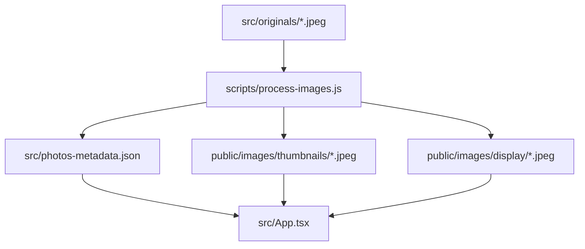

# Especificación de Diseño: Mapa de Fotos y Línea Temporal Interactiva

Esta especificación detalla la implementación de una interfaz web moderna y premium que muestra un mapa mundial interactivo con las ubicaciones de captura de un grupo de fotos y una gráfica de evolución temporal de las mismas.

---

## 1. Arquitectura y Enfoque Técnico

Para lograr el máximo rendimiento y una estética premium, adoptaremos un enfoque de **Preprocesamiento en Build-Time**:



### 1.1. Script de Procesamiento de Imágenes (`scripts/process-images.js`)
Un script de Node.js se ejecutará automáticamente antes de iniciar el servidor de desarrollo (`npm run dev`) y antes del compilado (`npm run build`). Este script realizará lo siguiente:
- Leerá todos los archivos `.jpeg`/`.jpg` en `src/originals/`.
- Usará `exifreader` para extraer:
  - Latitud y Longitud GPS (convertidas a formato decimal grados).
  - Fecha y hora original de la captura (`DateTimeOriginal`).
- Usará `sharp` para generar dos versiones optimizadas de cada imagen en el directorio `public/`:
  - **Miniaturas** (`public/images/thumbnails/`): 120x120px, recortadas cuadradas (`fit: 'cover'`), alta compresión, para los pines del mapa.
  - **Display** (`public/images/display/`): Máximo 1200px de ancho/alto (`fit: 'inside'`), para el diálogo modal.
- Generará un archivo `src/photos-metadata.json` con la siguiente estructura:
  ```typescript
  interface PhotoMetadata {
    id: string;
    filename: string;
    lat: number;
    lon: number;
    date: string; // Formato YYYY-MM-DD
    year: number;
    month: number;
    thumbnail: string; // Ruta pública /images/thumbnails/...
    display: string;   // Ruta pública /images/display/...
  }
  ```

### 1.2. Interfaz de Usuario (Frontend)
El diseño web adoptará un tema oscuro futurista con glassmorphism:
1. **Mapa del Mundo**:
   - Motor: Vanilla Leaflet inicializado a través de un hook de React en un contenedor `div`.
   - Estilo: Tiles oscuros **CartoDB Dark Matter** (`https://{s}.basemaps.cartocdn.com/dark_all/{z}/{x}/{y}{r}.png`).
   - Pines: Marcadores personalizados (`L.divIcon`) que renderizan la miniatura de la foto en un contenedor circular con sombra brillante (`box-shadow`) y un pequeño indicador en punta.
2. **Gráfico de Evolución Temporal (Timeline)**:
   - Componente React SVG nativo (sin dependencias de gráficas pesadas).
   - Agrupará las fotos cronológicamente por Mes y Año (ej. "Mar 2024", "Ago 2024").
   - Dibujará una gráfica de área fluida con un degradado lineal (morado neón a azul cian).
   - Al hacer hover sobre los nodos de la gráfica, se mostrará un tooltip premium y se resaltarán (efecto de pulso/animación) los pines correspondientes en el mapa.
3. **Diálogo Detallado (Lightbox)**:
   - Al pinchar en un pin o miniatura, se abrirá un modal flotante con desenfoque de fondo (`backdrop-filter: blur(8px)`).
   - Mostrará la foto a tamaño de visualización, fecha, coordenadas detalladas y un enlace externo para abrir la ubicación en Google Maps.

---

## 2. Cambios en Archivos y Dependencias

- **Dependencias**:
  - `leaflet` y `@types/leaflet` (Instalados para renderizar el mapa).
  - `sharp` y `exifreader` (Instalados en devDependencies para el procesamiento).
- **Archivos a Crear**:
  - `scripts/process-images.js`: Script de procesamiento.
  - `src/photos-metadata.json`: Datos generados (ignorado en `.gitignore` para no subir JSON autogenerados, o commiteado para la compilación base).
- **Archivos a Modificar**:
  - `package.json`: Modificar scripts de `dev` y `build` para ejecutar el script de imágenes.
  - `src/App.tsx`: Diseñar el dashboard interactivo de mapa + timeline.
  - `src/index.css`: Estilos globales de Leaflet y tokens de diseño.

---

## 3. Plan de Verificación

1. **Compilación y Procesamiento**:
   - Ejecutar `node scripts/process-images.js` y verificar que las carpetas `/public/images/thumbnails/` y `/public/images/display/` se crean con las imágenes optimizadas correspondientes, y que `src/photos-metadata.json` contiene la estructura correcta.
2. **Verificación de UI**:
   - Levantar el servidor de desarrollo con `npm run dev` y comprobar en el navegador:
     - El mapa se muestra en estilo oscuro y ubica correctamente las 8 fotos de prueba.
     - Las miniaturas se ven nítidas dentro de sus pines del mapa.
     - Al pinchar en un pin, se despliega el modal con la foto grande y los metadatos correctos.
     - La gráfica temporal SVG muestra la distribución correcta por meses y años y responde a eventos de hover.
3. **Linter y Tests**:
   - Ejecutar `npm run lint` y `npm run build` para asegurar la compilación completa de TypeScript.
