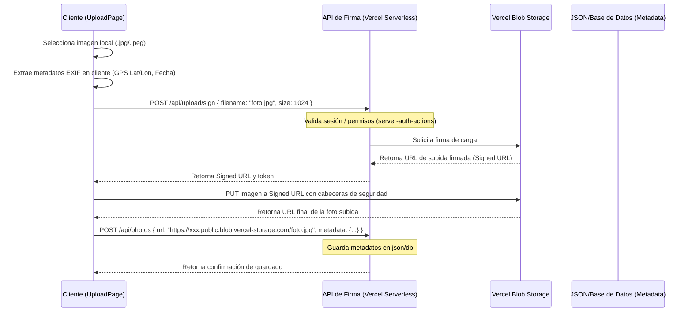

# Especificación de Diseño: Refactor y Flujo de Carga en Vercel

## 1. Introducción y Objetivos
Esta especificación define la reorganización del código base del Explorador de Viajes (actualmente condensado en [App.tsx](file:///Users/alex/Dev/yabbadabbadev/src/App.tsx)) y detalla la arquitectura para la futura implementación de la carga de imágenes a Vercel Blob.

### Objetivos Principales:
- **Estructuración en Páginas y Enrutamiento**: Introducir `react-router-dom` para soportar navegación entre el Explorador y la Carga.
- **Componentes Compuestos y Responsabilidad Única**: Seguir las directrices de Vercel (`vercel-composition-patterns`) separando la UI del estado e inyectando dependencias mediante un proveedor de contexto.
- **Archivos CSS y Módulos**: Extraer todos los estilos inline a archivos `.css` correspondientes a cada componente.
- **Estructura Barrel**: Proveer archivos `index.ts` por componente y página para exportaciones limpias.
- **Normas Mandatorias**: Actualizar [AGENTS.md](file:///Users/alex/Dev/yabbadabbadev/AGENTS.md) para registrar estas prácticas como reglas de calidad estrictas.
- **Diseño del Flujo de Carga en Vercel**: Definir la spec técnica y el flujo detallado para subir fotos con metadatos GPS utilizando Vercel Blob y firmas seguras desde el cliente.

---

## 2. Arquitectura de Enrutamiento y Directorios

Implementaremos la estructura recomendada utilizando `react-router-dom`:

```
src/
├── App.tsx                   # Enrutador principal de la aplicación
├── main.tsx                  # Entrada de React 19
├── index.css                 # Estilos globales y tokens CSS
├── types.ts                  # Tipos globales de fotos y metadatos
├── pages/                    # Directorio de Páginas
│   ├── ExplorerPage/         # Página principal del mapa y timeline
│   │   ├── ExplorerPage.tsx
│   │   ├── ExplorerPage.css
│   │   ├── index.ts
│   │   └── components/       # Componentes exclusivos de la página
│   │       ├── ExplorerProvider/
│   │       │   ├── ExplorerProvider.tsx
│   │       │   ├── types.ts
│   │       │   └── index.ts
│   │       ├── Map/
│   │       │   ├── Map.tsx
│   │       │   ├── Map.css
│   │       │   ├── types.ts
│   │       │   └── index.ts
│   │       ├── Timeline/
│   │       │   ├── Timeline.tsx
│   │       │   ├── Timeline.css
│   │       │   ├── types.ts
│   │       │   └── index.ts
│   │       ├── Lightbox/
│   │       │   ├── Lightbox.tsx
│   │       │   ├── Lightbox.css
│   │       │   ├── types.ts
│   │       │   └── index.ts
│   │       └── Header/
│   │           ├── Header.tsx
│   │           ├── Header.css
│   │           ├── types.ts
│   │           └── index.ts
│   ├── UploadPage/           # Placeholder de la página de carga a Vercel
│   │   ├── UploadPage.tsx
│   │   ├── UploadPage.css
│   │   └── index.ts
│   └── __tests__/            # Tests unitarios e integración de páginas
│       └── ExplorerPage.test.tsx
└── app/
    └── components/           # Componentes comunes para el futuro
```

---

## 3. Refactor del Explorador: Patrones de Composición de Vercel

Siguiendo `vercel-composition-patterns`, desacoplaremos el estado de la interfaz mediante `ExplorerProvider`.

### 3.1 Interfaz del Contexto (`ExplorerContext`)
El estado compartido entre todos los subcomponentes del explorador se inyectará mediante una interfaz genérica de tres partes: `state`, `actions` y `meta`:

```typescript
export interface ExplorerState {
  selectedPhoto: PhotoMetadata | null
  hoveredTimeNode: string | null
  selectedTimeNode: string | null
  highlightedPhotoIds: Set<string>
  timelineData: TimelineDataNode[]
}

export interface ExplorerActions {
  setSelectedPhoto: (photo: PhotoMetadata | null) => void
  setHoveredTimeNode: (node: string | null) => void
  setSelectedTimeNode: (node: string | null) => void
  clearTimeFilter: () => void
}

export interface ExplorerMeta {
  mapInstance: React.MutableRefObject<L.Map | null>
  markersRef: React.MutableRefObject<{ [key: string]: L.Marker }>
  boundsRef: React.MutableRefObject<L.LatLngBounds | null>
  lastMapStateRef: React.MutableRefObject<{ center: L.LatLng; zoom: number } | null>
  dialogRef: React.RefObject<HTMLDialogElement | null>
}

export interface ExplorerContextValue {
  state: ExplorerState
  actions: ExplorerActions
  meta: ExplorerMeta
}
```

### 3.2 División de Componentes
1. **`ExplorerProvider`**: Contiene la lógica de inicialización del mapa Leaflet, la generación de los puntos de la línea de tiempo, el filtrado y el mantenimiento de las referencias.
2. **`Map`**: Dibuja el contenedor del mapa y maneja la creación de marcadores/pines visuales usando `leaflet`. Lee los datos del mapa de `state` y `meta`.
3. **`Timeline`**: Renderiza el SVG spline de la línea temporal y gestiona eventos `onMouseEnter`/`onClick` interactuando con las acciones del contexto.
4. **`Lightbox`**: Muestra la foto seleccionada y sus detalles en un modal nativo `<dialog>`, ofreciendo un enlace externo a Google Maps.
5. **`Header`**: Muestra el título decorado de la app y la cantidad total de fotos cargadas.

---

## 4. Diseño del Flujo de Carga en Vercel (Spec Técnica)

Aunque no se implementará el código ejecutable ahora mismo, definimos la arquitectura detallada para la carga en Vercel.

### 4.1 Arquitectura del Flujo
El flujo utilizará la **Carga Directa en Vercel Blob** con URLs firmadas en el servidor, evitando las limitaciones de tiempo y payload de las API routes serverless de Vercel.



### 4.2 Endpoint de Firma (`/api/upload/sign`)
- **Tipo**: API Route o Server Action.
- **Seguridad**: Valida autenticación del usuario.
- **Función**: Usa `@vercel/blob` (`generateClientTokenPayload`) para generar un payload firmado con validez de corta duración (ej. 10 minutos).

### 4.3 Endpoint de Guardado de Metadatos (`/api/photos`)
- **Función**: Recibe la URL pública generada por Vercel Blob y los metadatos GPS/Fecha del cliente.
- **Acción**: Actualiza el archivo `photos-metadata.json` (o escribe en base de datos) añadiendo el nuevo nodo de foto de forma persistente.

### 4.4 Componente de Carga (`UploadPage`)
- Contiene un drag-and-drop de archivos.
- Lógica de previsualización.
- Lector de EXIF (`exifreader`) ejecutado en el cliente para parsear latitud, longitud y fecha de captura de forma inmediata, permitiendo al usuario corregir o añadir metadatos si no existen.
- Botón de carga con indicador de progreso.

---

## 5. Actualización de Normas en `AGENTS.md`

Añadiremos directrices estrictas para asegurar que ningún agente posterior rompa esta estructura. Las reglas obligatorias incluirán:
- Estructura de directorio de componentes obligatoria: `directorio/` -> `.tsx`, `.css`, `types.ts`, `index.ts`.
- Prohibición de estilos inline en componentes refactorizados (deben estar en archivos `.css`).
- Uso mandatorio de patrones de composición Vercel (`state`, `actions`, `meta` en contexto) para páginas y flujos con interacción compleja.

---

## 6. Autoevaluación del Diseño
1. **Cobertura**: Cubre la extracción de componentes, los barrels, archivos CSS separados, tipos y la especificación detallada de carga en Vercel.
2. **Consistencia**: El uso de la separación de contexto `{ state, actions, meta }` previene el prop drilling y proporciona una interfaz limpia para los tests unitarios.
3. **Ausencia de Placeholders**: Todo está definido de manera exacta y concisa.
